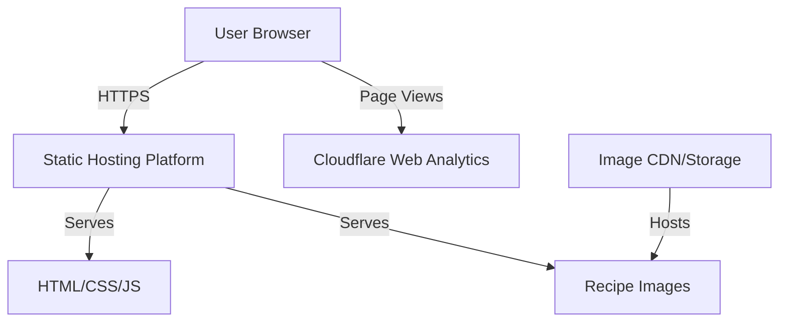

# Design Document

## Overview

The Recipe Website is a static, client-side web application that provides access to recipes organized in 8 categories with multilingual support (Romanian/English), theme switching (dark/light), text size adjustment, ingredient scaling, and filtering capabilities. The application can be hosted on any static hosting platform (GitHub Pages, Netlify, Vercel, etc.) and uses Cloudflare Web Analytics for privacy-friendly analytics tracking without cookies.

### Key Design Principles

- **Static-first architecture**: All recipe data is embedded in the application at build time, eliminating the need for a backend API
- **Client-side rendering**: All functionality runs in the browser using vanilla JavaScript or a lightweight framework
- **Responsive design**: Mobile-first approach ensuring optimal experience across all devices
- **Minimal distractions**: Clean, focused UI with controls positioned at the bottom of pages
- **Performance**: Fast load times with optimized images and minimal dependencies

## Architecture

### High-Level Architecture



### Technology Stack

**Development Environment:**
- **Runtime**: Node.js 18+ (development tooling only, not used in production)
- **Package Manager**: npm or yarn

**Frontend Stack:**
- **Language**: TypeScript 5+ (type safety for recipe data structures and components)
- **Framework**: React 18+ (component reusability, hooks, and state management)
- **Build Tool**: Vite 5+ (fast builds, HMR, optimized production bundles)
- **Styling**: Tailwind CSS 3+ (utility-first CSS with built-in responsive and dark mode)
- **Routing**: React Router 6+ (client-side routing)

**Hosting Options:**
- **GitHub Pages**: Free static hosting with custom domains
- **Netlify**: Free tier with automatic deployments
- **Vercel**: Free tier with edge network
- **Cloudflare Pages**: Free tier with global CDN
- Any static hosting platform

**Analytics:**
- **Cloudflare Web Analytics**: Free, privacy-friendly web analytics without cookies

**Image Storage:**
- **GitHub Repository**: Images stored in repo (simple, version controlled)
- **CDN Options**: Cloudinary, imgix, or any CDN service (optional optimization)

**Key Dependencies:**
- `react` & `react-dom`: UI framework
- `react-router-dom`: Client-side routing
- `tailwindcss`: Utility-first CSS framework
- `typescript`: Type checking and compilation
- `vite`: Build tool and dev server

**Development Dependencies:**
- `vitest`: Unit testing (Vite-native test runner)
- `@testing-library/react`: Component testing utilities
- `@types/*`: TypeScript type definitions

**Production Output:**
- Static HTML, CSS, and JavaScript files
- No Node.js runtime required in production
- Can be deployed to any static hosting platform

### Data Architecture

All recipe data will be stored as JSON files organized by category folders:

```
/src
  /data
    /recipes
      /breakfast
        pancakes.json
        omelette.json
        ...
      /pasta
        carbonara.json
        bolognese.json
        ...
      /stir-fries
        chicken-stir-fry.json
        vegetable-stir-fry.json
        ...
      /soups-and-stews
        chicken-soup.json
        beef-stew.json
        ...
      /main-courses
        roast-chicken.json
        grilled-salmon.json
        ...
      /burgers-and-wraps
        classic-burger.json
        chicken-wrap.json
        ...
      /salads-and-bites
        caesar-salad.json
        bruschetta.json
        ...
      /basics
        boiled-rice.json
        mashed-potatoes.json
        ...
    categories.json
    filter-keywords.json
    translations.json
```

**Category Folder Structure:**
- Each category has its own folder under `/src/data/recipes/`
- Recipe files can be named descriptively (no numbering required)
- The system automatically loads all JSON files from all category folders
- Category is determined by the folder the recipe is in
- Easy to add new recipes by simply adding JSON files to the appropriate folder

## Components and Interfaces

### Component Hierarchy

```
App
├── Header
│   ├── HomeLink
│   ├── SearchBar
│   └── MenuButton
├── SideMenu (1/3 screen width)
│   ├── FiltersSection (expandable)
│   │   ├── DifficultyFilters
│   │   ├── MeatTypeFilters
│   │   ├── CookTypeFilters
│   │   └── IngredientFilters
│   ├── CategoriesSection (expandable)
│   │   └── CategoryLinks (8 categories)
│   ├── CookingBasicsLink
│   └── AboutLink
├── Router
│   ├── HomePage
│   │   └── RecipeGrid
│   │       └── RecipeCard
│   ├── RecipePage
│   │   ├── RecipeHeader (prep time, servings, effort)
│   │   ├── RecipeImage
│   │   ├── IngredientList
│   │   │   └── IngredientScaler
│   │   └── InstructionList
│   ├── AboutPage
│   └── CookingBasicsPage
└── Footer
    ├── LanguageSelector
    ├── TextSizeSelector
    └── ThemeSelector
```

### Core Components

#### 1. RecipePage Component

Displays a single recipe with all details.

**Props:**
- `recipeId: string` - Unique identifier for the recipe

**State:**
- `servingMultiplier: number` - Current scaling factor for ingredients (default: 1)

**Layout:**
```
┌─────────────────────────────────┐
│ Recipe Title                     │
│ Category Badge                   │
├─────────────────────────────────┤
│ ⏱️ Prep Time | 🍽️ Servings | 💪 Effort │
├─────────────────────────────────┤
│                                  │
│     [Recipe Image 1200x1200]    │
│                                  │
├─────────────────────────────────┤
│ Ingredients                      │
│ [Scaler: - 1x +]                │
│ • Ingredient 1 (scaled qty)     │
│ • Ingredient 2 (scaled qty)     │
├─────────────────────────────────┤
│ Instructions                     │
│ 1. Step one...                  │
│ 2. Step two...                  │
├─────────────────────────────────┤
│ Personal Notes                   │
│ Personal opinions, preferences,  │
│ and backstory about the recipe   │
├─────────────────────────────────┤
│ [Footer with selectors]         │
└─────────────────────────────────┘
```

#### 2. IngredientScaler Component

Allows users to adjust ingredient quantities.

**Props:**
- `currentMultiplier: number`
- `onMultiplierChange: (multiplier: number) => void`

**Behavior:**
- Provides buttons to increment/decrement by 0.5x
- Displays current multiplier (e.g., "0.5x", "1x", "1.5x", "2x", "2.5x", "3x")
- Minimum: 0.5x, Maximum: 3x
- Increment step: 0.5x

#### 3. Header Component

The main navigation bar at the top of every page.

**Props:**
- `onMenuToggle: () => void` - Callback when menu button is clicked

**Layout:**
```
┌─────────────────────────────────────────────┐
│ [Home]    [Search Bar...]    [☰ Menu]      │
└─────────────────────────────────────────────┘
```

**Behavior:**
- Fixed at the top of the page
- Home link on the left navigates to homepage
- Search bar in the center (only visible on homepage)
- Menu icon button on the right opens the side menu

#### 4. SideMenu Component

A side panel that slides in from the right, occupying one-third of the screen width.

**Props:**
- `isOpen: boolean` - Controls visibility of the side menu
- `onClose: () => void` - Callback when menu should close
- `selectedKeywords: Set<string>` - Currently selected filter keywords
- `onKeywordsChange: (keywords: Set<string>) => void` - Callback when keywords change

**Sections:**
1. **Filters** (expandable)
   - Difficulty (e.g., easy, medium, hard)
   - Meat Type (e.g., chicken, beef, pork, fish, vegetarian)
   - Cook Type (e.g., baking, frying, boiling, grilling, stir-fry)
   - Ingredient (e.g., tomatoes, onions, peppers, potatoes, pasta, rice)

2. **Categories** (expandable)
   - Lists all 8 food categories
   - Clicking a category scrolls to that section on the homepage

3. **Cooking Basics** (link)
   - Navigates to Cooking Basics page

4. **About** (link)
   - Navigates to About page

**Behavior:**
- Slides in from the right when opened
- Occupies 1/3 of screen width
- Filters and Categories sections are expandable/collapsible
- Displays filter keyword checkboxes grouped by the four filter types
- Updates parent component state when keywords are selected/deselected
- Can be closed by clicking outside, pressing Escape, or clicking a close button
- Maintains selected filters when closed
- Category links scroll to the corresponding section on the homepage

**Layout:**
```
┌─────────────────────────────────┐
│ [X] Close                        │
├─────────────────────────────────┤
│ ▼ Filters                        │
│   ▼ Difficulty                   │
│     ☐ Easy                       │
│     ☐ Medium                     │
│     ☐ Hard                       │
│   ▼ Meat Type                    │
│     ☐ Chicken                    │
│     ☐ Beef                       │
│     ☐ Pork                       │
│   ▼ Cook Type                    │
│     ☐ Baking                     │
│     ☐ Frying                     │
│   ▼ Ingredient                   │
│     ☐ Tomatoes                   │
│     ☐ Onions                     │
│   [Clear All Filters]            │
├─────────────────────────────────┤
│ ▼ Categories                     │
│   • Breakfast                    │
│   • Pasta                        │
│   • Stir-Fries                   │
│   • Soups & Stews                │
│   • Main Courses                 │
│   • Burgers & Wraps              │
│   • Salads & Bites               │
│   • Basics                       │
├─────────────────────────────────┤
│ Cooking Basics                   │
├─────────────────────────────────┤
│ About                            │
└─────────────────────────────────┘
```

#### 5. SearchBar Component

A text input component in the Header that filters recipes by title in real-time.

**Props:**
- `searchQuery: string` - Current search text
- `onSearchChange: (query: string) => void` - Callback when search text changes
- `language: Language` - Current language for placeholder text

**Behavior:**
- Displays a text input field with search icon in the center of the Header
- Shows a clear button (X symbol) when text is entered
- Triggers filtering when at least 2 characters are typed
- Clears search text when X button is clicked
- Updates in real-time as user types
- Only visible on the homepage

**Layout:**
```
┌─────────────────────────────────┐
│ 🔍 [Search recipes...      ] [X]│
└─────────────────────────────────┘
```

#### 6. HomePage Component

Displays all recipes with integrated filtering and search.

**State:**
- `selectedKeywords: Set<string>` - Currently selected filter keywords
- `isSideMenuOpen: boolean` - Controls SideMenu visibility
- `searchQuery: string` - Current search text

**Filtering Logic:**
```typescript
const filteredRecipes = recipes.filter((recipe: Recipe) => {
  // Apply keyword filtering
  const matchesKeywords = selectedKeywords.size === 0 || 
    [...selectedKeywords].every(keyword => recipe.keywords.includes(keyword));
  
  // Apply search filtering (only if 2+ characters)
  const matchesSearch = searchQuery.length < 2 || 
    recipe.title[language].toLowerCase().includes(searchQuery.toLowerCase());
  
  return matchesKeywords && matchesSearch;
});
```

**Category Scrolling:**
- Each category section on the homepage has an ID (e.g., `#breakfast`, `#pasta`)
- When a category is clicked in the SideMenu, the page scrolls to that section
- Uses smooth scrolling behavior

**Layout:**
```
┌─────────────────────────────────┐
│ [Home] [Search Bar...] [☰ Menu] │
├─────────────────────────────────┤
│ All Recipes (X)                  │
├─────────────────────────────────┤
│ [Recipe Grid by Category]        │
│                                  │
│ === Breakfast ===                │
│ [Recipe Cards]                   │
│                                  │
│ === Pasta ===                    │
│ [Recipe Cards]                   │
│                                  │
│ ... (all 8 categories)           │
└─────────────────────────────────┘

When side menu is open:
┌──────────────────────┬──────────┐
│ [Home] [Search] [☰]  │ Side     │
├──────────────────────┤ Menu     │
│ All Recipes (X)      │          │
├──────────────────────┤ [Filters]│
│ [Recipe Grid]        │ [Cats]   │
│                      │ [Links]  │
│                      │          │
└──────────────────────┴──────────┘
```

#### 7. Footer Component

Contains all user preference controls.

**Layout:**
```
┌─────────────────────────────────┐
│ 🌐 RO | EN                      │
│ 📏 A | A                        │
│ 🌙 Dark | Light                 │
└─────────────────────────────────┘
```

**Persistence:**
All preferences stored in `localStorage`:
- `userLanguage`: "ro" | "en"
- `userTextSize`: "normal" | "large"
- `userTheme`: "dark" | "light"

### Navigation Structure

```
Home (/)
├── Recipe Detail (/recipe/:id)
├── About (/about)
└── Cooking Basics (/cooking-basics)
```

**Header Navigation:**
- Home link: Always visible, navigates to homepage
- Search bar: Only visible on homepage, filters recipes in real-time
- Menu button: Opens side menu with filters, categories, and page links

**Side Menu Navigation:**
- Filters section: Expandable, filters recipes on homepage
- Categories section: Expandable, scrolls to category sections on homepage
- Cooking Basics: Link to /cooking-basics page
- About: Link to /about page

Note: Filtering and category navigation are integrated into the HomePage via the side menu, not separate routes.

## Data Models

### Recipe Model

```typescript
interface Recipe {
  id: string; // Unique identifier (can be filename without .json)
  category: string; // Derived from folder name (breakfast, pasta, etc.)
  title: {
    ro: string;
    en: string;
  };
  prepTime: number; // minutes
  servings: number;
  effortLevel: "easy" | "medium" | "hard";
  image: string; // Relative path to image
  ingredients: Ingredient[];
  instructions: {
    ro: string[];
    en: string[];
  };
  personalNotes: {
    ro: string;
    en: string;
  }; // Personal opinions, preferences, backstory
  keywords: string[]; // Filter keywords
  dateAdded: string; // ISO 8601 date string (YYYY-MM-DD) - used for sorting recipes
}

interface Ingredient {
  name: {
    ro: string;
    en: string;
  };
  quantity: number;
  unit: {
    ro: string;
    en: string;
  };
}
```

**Recipe Loading Strategy:**
- Recipes are loaded dynamically from all 8 category folders
- The `category` field is automatically set based on the folder the recipe is in
- The `id` can be derived from the filename (e.g., `carbonara.json` → id: `carbonara`)
- No need for sequential numbering - just add JSON files to the appropriate folder
- Recipes are sorted by `dateAdded` in ascending order (oldest first) within each category

### Category Model

```typescript
interface Category {
  id: string;
  folder: string; // Folder name in /src/data/recipes/
  name: {
    ro: string;
    en: string;
  };
}
```

**The 8 Categories:**
1. **breakfast** - Breakfast recipes
2. **pasta** - Pasta dishes
3. **stir-fries** - Stir-fry recipes
4. **soups-and-stews** - Soups and stews
5. **main-courses** - Main course dishes
6. **burgers-and-wraps** - Burgers and wraps
7. **salads-and-bites** - Salads and appetizers
8. **basics** - Basic cooking techniques and staples

### Filter Keyword Model

```typescript
interface FilterKeyword {
  id: string;
  type: "difficulty" | "meat" | "cook" | "ingredient";
  label: {
    ro: string;
    en: string;
  };
}
```

### Translation Model

```typescript
interface Translations {
  ro: {
    [key: string]: string;
  };
  en: {
    [key: string]: string;
  };
}
```

## Styling and Theming

### Tailwind Configuration

**File**: `tailwind.config.ts`

```typescript
import type { Config } from 'tailwindcss'

export default {
  content: [
    "./index.html",
    "./src/**/*.{js,ts,jsx,tsx}",
  ],
  darkMode: 'class', // Enable class-based dark mode
  theme: {
    extend: {
      colors: {
        primary: {
          light: '#ffffff',
          dark: '#1a1a1a',
        },
        secondary: {
          light: '#f5f5f5',
          dark: '#2d2d2d',
        },
        accent: {
          light: '#e74c3c',
          dark: '#ff6b6b',
        },
      },
    },
  },
  plugins: [],
} satisfies Config
```

### Theme Implementation

Apply theme class to root element:

```typescript
// Light theme (default)
<html lang="ro">

// Dark theme
<html lang="ro" class="dark">
```

### Text Size Implementation

Apply text size class to root element:

```typescript
// Normal text (default)
<html lang="ro" class="text-base">

// Large text
<html lang="ro" class="text-lg">
```

### Responsive Design with Tailwind

Tailwind's built-in breakpoints:
- `sm`: 640px (mobile landscape)
- `md`: 768px (tablet)
- `lg`: 1024px (desktop)
- `xl`: 1280px (large desktop)

Example usage:
```jsx
<div className="p-4 md:p-8 lg:max-w-4xl lg:mx-auto">
  {/* Mobile: 1rem padding, Desktop: 2rem padding, centered with max-width */}
</div>
```

## Error Handling

### Client-Side Error Scenarios

1. **Missing Recipe Data**
   - Display: "Recipe not found" message
   - Action: Redirect to home page after 3 seconds

2. **Invalid Recipe ID**
   - Display: "Invalid recipe" message
   - Action: Redirect to home page

3. **Image Load Failure**
   - Display: Placeholder image with recipe icon
   - Log error to console

4. **Analytics Failure**
   - Fail silently (don't block user experience)
   - Log error to console

### User Input Validation

1. **Ingredient Scaler**
   - Clamp values between 0.5x and 3x
   - Increment/decrement in steps of 0.5x
   - Round to nearest 0.5x

2. **Filter Selection**
   - No validation needed (predefined options)

## Testing Strategy

### Unit Testing

**Framework**: Vitest (Vite's native test runner) + React Testing Library

**Test Coverage:**

1. **Component Tests**
   - RecipePage: Renders all recipe data correctly
   - IngredientScaler: Calculates scaled quantities correctly
   - FilterPage: Filters recipes based on selected keywords
   - Footer: Persists preferences to localStorage

2. **Utility Function Tests**
   - `scaleIngredient(ingredient, multiplier)`: Returns correct scaled values
   - `filterRecipes(recipes, keywords)`: Returns correct filtered results
   - `getTranslation(key, language)`: Returns correct translation

3. **Hook Tests**
   - `useLocalStorage`: Reads and writes to localStorage correctly
   - `useRecipeData`: Loads recipe data correctly

### Integration Testing

**Test Scenarios:**

1. **Language Switching**
   - Change language → All text updates
   - Navigate to different page → Language persists

2. **Theme Switching**
   - Toggle theme → CSS variables update
   - Refresh page → Theme persists

3. **Ingredient Scaling**
   - Adjust scaler → All ingredient quantities update
   - Navigate away and back → Scaler resets to 1x

4. **Filtering**
   - Select keywords → Recipe list updates
   - Clear all keywords → All recipes shown

### Manual Testing Checklist

- [ ] Test on Chrome (desktop and mobile)
- [ ] Test on Firefox (desktop and mobile)
- [ ] Test on Safari (desktop and mobile)
- [ ] Test on Edge (desktop)
- [ ] Verify all 55 recipes display correctly
- [ ] Verify all images load (1200x1200)
- [ ] Test responsive layouts at various screen sizes
- [ ] Verify analytics events fire correctly
- [ ] Test all filter combinations
- [ ] Verify Romanian translations are accurate
- [ ] Verify English translations are accurate

## Deployment Architecture

### Static Hosting Configuration

For platforms that support configuration files (like Netlify, Vercel), create appropriate config:

**Netlify** (`netlify.toml`):
```toml
[build]
  command = "npm run build"
  publish = "dist"

[[redirects]]
  from = "/*"
  to = "/index.html"
  status = 200
```

**Vercel** (`vercel.json`):
```json
{
  "rewrites": [
    { "source": "/(.*)", "destination": "/index.html" }
  ]
}
```

**GitHub Pages**: No configuration needed, just deploy the `dist` folder.

### Cloudflare Web Analytics Integration

**No Installation Required** - Cloudflare Web Analytics uses a simple script tag, no npm packages needed.

**Setup Steps:**

1. **Sign up for Cloudflare** (free account)
2. **Add your site to Web Analytics** in the Cloudflare dashboard
3. **Get your tracking token** from the dashboard
4. **Add the script to your HTML**

**Implementation:**

Add the Cloudflare Web Analytics script to `index.html`:

```html
<!-- In index.html, before closing </body> tag -->
<script defer 
        src='https://static.cloudflareinsights.com/beacon.min.js' 
        data-cf-beacon='{"token": "YOUR_TOKEN_HERE"}'>
</script>
```

**What Gets Tracked Automatically:**
- Page views (all routes)
- Unique visitors (estimated, privacy-friendly)
- Referrers (where visitors come from)
- Top pages
- Countries
- Browsers and devices

**Privacy Benefits:**
- ✅ No cookies used
- ✅ No personal data collected
- ✅ GDPR compliant by default
- ✅ No consent banner required
- ✅ Respects user privacy

**Configuration:**

Create `.env` file (optional, for documentation):
```
# Cloudflare Web Analytics Token
# Add this token to index.html script tag
VITE_CF_ANALYTICS_TOKEN=your-token-here
```

**Note:** Unlike Google Analytics, Cloudflare Web Analytics doesn't require JavaScript initialization or custom event tracking code. Simply add the script tag and it works automatically.

### Image Storage Options

**Option 1: GitHub Repository (Simplest)**
```
/public
  /images
    /recipes
      recipe-001.webp
      recipe-002.webp
      ...
      placeholder.webp
```
- Images served directly from your repo
- No external dependencies
- Version controlled with code

**Option 2: CDN Service (Optimized)**
- Cloudinary (free tier available)
- imgix (free tier available)
- Any CDN service

**Image Specifications:**
- Format: WebP (with JPEG fallback)
- Dimensions: 1200x1200px
- Optimized for web delivery

### Build and Deployment Pipeline

**GitHub Actions for GitHub Pages:**

```yaml
name: Deploy to GitHub Pages

on:
  push:
    branches: [main]

permissions:
  contents: read
  pages: write
  id-token: write

jobs:
  build:
    runs-on: ubuntu-latest
    steps:
      - uses: actions/checkout@v3
      - uses: actions/setup-node@v3
        with:
          node-version: '18'
      - run: npm ci
      - run: npm run build
        env:
          VITE_GA_MEASUREMENT_ID: ${{ secrets.GA_MEASUREMENT_ID }}
      - uses: actions/upload-pages-artifact@v2
        with:
          path: ./dist
  
  deploy:
    needs: build
    runs-on: ubuntu-latest
    environment:
      name: github-pages
      url: ${{ steps.deployment.outputs.page_url }}
    steps:
      - uses: actions/deploy-pages@v2
        id: deployment
```

**Netlify/Vercel**: Connect your GitHub repo and they auto-deploy on push.

## Performance Considerations

### Image Optimization

- Use WebP format with JPEG fallback
- Implement lazy loading for recipe images
- Serve images from Azure CDN
- Generate responsive image sizes (600px, 1200px)

### Code Splitting

```typescript
import { lazy } from 'react';

// Lazy load pages
const RecipePage = lazy(() => import('./pages/RecipePage'));
const FilterPage = lazy(() => import('./pages/FilterPage'));
const AboutPage = lazy(() => import('./pages/AboutPage'));
const CookingBasicsPage = lazy(() => import('./pages/CookingBasicsPage'));
```

### Bundle Size Optimization

- Tree-shake unused code
- Minimize dependencies
- Use production builds
- Enable gzip/brotli compression (automatic on most platforms)

### Caching Strategy

```
Cache-Control headers:
- HTML: no-cache
- CSS/JS: max-age=31536000 (1 year, with hash in filename)
- Images: max-age=31536000 (1 year)
- JSON data: max-age=3600 (1 hour)
```

## Accessibility

### WCAG 2.1 AA Compliance

1. **Color Contrast**
   - Ensure 4.5:1 contrast ratio for normal text
   - Ensure 3:1 contrast ratio for large text

2. **Keyboard Navigation**
   - All interactive elements accessible via Tab
   - Focus indicators visible
   - Skip to main content link

3. **Screen Reader Support**
   - Semantic HTML elements
   - ARIA labels where needed
   - Alt text for all images

4. **Text Scaling**
   - Support browser zoom up to 200%
   - Text size adjuster provides additional control

### Semantic HTML Structure

```html
<main>
  <article>
    <header>
      <h1>Recipe Title</h1>
      <div role="contentinfo">Prep time, servings, effort</div>
    </header>
    
    <section aria-label="Ingredients">
      <h2>Ingredients</h2>
      <ul>...</ul>
    </section>
    <section aria-label="Instructions">
      <h2>Instructions</h2>
      <ol>...</ol>
    </section>
  </article>
</main>
<footer>
  <nav aria-label="User preferences">...</nav>
</footer>
```

## Security Considerations

### Content Security Policy

```html
<meta http-equiv="Content-Security-Policy" 
      content="default-src 'self'; 
               img-src 'self' data:; 
               script-src 'self' https://static.cloudflareinsights.com;
               connect-src 'self' https://cloudflareinsights.com;
               style-src 'self' 'unsafe-inline';">
```

### Data Privacy

- No user authentication required
- No personal data collected
- No cookies used (Cloudflare Web Analytics is cookie-free)
- Analytics data is privacy-friendly and anonymous
- Preferences stored locally only (localStorage)
- GDPR compliant by default

## Comment System

### Giscus Integration (About Page)

**Overview:**
The About Page includes a comment section powered by Giscus, which uses GitHub Discussions as a backend. This provides a free, ad-free, privacy-friendly commenting system without requiring a separate backend.

**Why Giscus:**
- ✅ Completely free, no ads
- ✅ No backend required
- ✅ Privacy-friendly (GDPR compliant)
- ✅ Users comment with GitHub accounts
- ✅ Supports reactions and replies
- ✅ Markdown formatting support
- ✅ Easy moderation via GitHub
- ✅ Themes match site (light/dark)
- ✅ Data stored in your GitHub repo

**Setup:**

1. **Enable GitHub Discussions** on your repository
2. **Install Giscus app** on your GitHub repo (https://github.com/apps/giscus)
3. **Configure Giscus** at https://giscus.app to get your script tag
4. **Add script to AboutPage** component

**Implementation:**

Add the Giscus script to the About page:

```tsx
// In AboutPage.tsx, at the bottom before Footer
<div className="giscus-container max-w-4xl mx-auto px-4 py-8">
  <script
    src="https://giscus.app/client.js"
    data-repo="your-username/your-repo"
    data-repo-id="YOUR_REPO_ID"
    data-category="General"
    data-category-id="YOUR_CATEGORY_ID"
    data-mapping="pathname"
    data-strict="0"
    data-reactions-enabled="1"
    data-emit-metadata="0"
    data-input-position="bottom"
    data-theme="preferred_color_scheme"
    data-lang="en"
    crossorigin="anonymous"
    async>
  </script>
</div>
```

**Configuration Options:**
- `data-repo`: Your GitHub repository (e.g., "username/recipe-website")
- `data-mapping`: "pathname" (each page gets its own discussion)
- `data-theme`: "preferred_color_scheme" (auto light/dark based on user preference)
- `data-reactions-enabled`: "1" (allow emoji reactions)
- `data-lang`: "en" or "ro" (comment interface language)

**Features:**
- Users can comment using their GitHub accounts
- Supports threaded replies
- Emoji reactions (👍 ❤️ 🎉 etc.)
- Markdown formatting in comments
- Automatic spam protection via GitHub
- You moderate via GitHub Discussions interface

**Privacy:**
- No tracking cookies
- No ads
- Users control their GitHub data
- GDPR compliant

**Moderation:**
- Manage comments in your GitHub repo's Discussions tab
- Delete, edit, or lock discussions
- Block users if needed
- All standard GitHub moderation tools available

## Future Enhancements (Out of Scope)

- PDF export functionality
- User recipe submissions
- Recipe ratings and reviews
- Shopping list generation
- Meal planning features
- Recipe search functionality
- Social sharing
