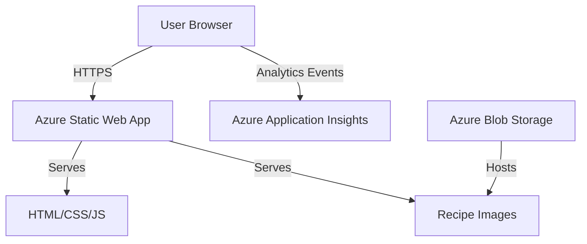

# Design Document

## Overview

The Recipe Website is a static, client-side web application that provides access to 55 recipes with multilingual support (Romanian/English), theme switching (dark/light), text size adjustment, ingredient scaling, and filtering capabilities. The application will be hosted on Azure Static Web Apps and use Azure Application Insights for analytics tracking.

### Key Design Principles

- **Static-first architecture**: All recipe data is embedded in the application at build time, eliminating the need for a backend API
- **Client-side rendering**: All functionality runs in the browser using vanilla JavaScript or a lightweight framework
- **Responsive design**: Mobile-first approach ensuring optimal experience across all devices
- **Minimal distractions**: Clean, focused UI with controls positioned at the bottom of pages
- **Performance**: Fast load times with optimized images and minimal dependencies

## Architecture

### High-Level Architecture



### Technology Stack

**Development Environment:**
- **Runtime**: Node.js 18+ (development tooling only, not used in production)
- **Package Manager**: npm or yarn

**Frontend Stack:**
- **Language**: TypeScript 5+ (type safety for recipe data structures and components)
- **Framework**: React 18+ (component reusability, hooks, and state management)
- **Build Tool**: Vite 5+ (fast builds, HMR, optimized production bundles)
- **Styling**: Tailwind CSS 3+ (utility-first CSS with built-in responsive and dark mode)
- **Routing**: React Router 6+ (client-side routing)

**Azure Services:**
- **Hosting**: Azure Static Web Apps (serves static HTML/CSS/JS files, no server runtime)
- **Analytics**: Azure Application Insights JavaScript SDK
- **Image Storage**: Azure Blob Storage with CDN (for 1200x1200 recipe images)

**Key Dependencies:**
- `react` & `react-dom`: UI framework
- `react-router-dom`: Client-side routing
- `@microsoft/applicationinsights-web`: Analytics tracking
- `tailwindcss`: Utility-first CSS framework
- `typescript`: Type checking and compilation
- `vite`: Build tool and dev server

**Development Dependencies:**
- `vitest`: Unit testing (Vite-native test runner)
- `@testing-library/react`: Component testing utilities
- `@types/*`: TypeScript type definitions

**Production Output:**
- Static HTML, CSS, and JavaScript files
- No Node.js runtime required in production
- Deployed to Azure Static Web Apps CDN

### Data Architecture

All recipe data will be stored as JSON files in the project structure:

```
/src
  /data
    /recipes
      recipe-001.json
      recipe-002.json
      ...
    /cooking-basics
      boiling-rice.json
      mashed-potatoes.json
      ...
    categories.json
    filter-keywords.json
    translations.json
```

## Components and Interfaces

### Component Hierarchy

```
App
├── Header
│   └── Navigation
├── Router
│   ├── HomePage
│   │   └── RecipeGrid
│   │       └── RecipeCard
│   ├── RecipePage
│   │   ├── RecipeHeader (prep time, servings, effort)
│   │   ├── RecipeImage
│   │   ├── IngredientList
│   │   │   └── IngredientScaler
│   │   └── InstructionList
│   ├── FilterPage
│   │   ├── FilterControls
│   │   └── RecipeGrid
│   ├── AboutPage
│   └── CookingBasicsPage
└── Footer
    ├── LanguageSelector
    ├── TextSizeSelector
    └── ThemeSelector
```

### Core Components

#### 1. RecipePage Component

Displays a single recipe with all details.

**Props:**
- `recipeId: string` - Unique identifier for the recipe

**State:**
- `servingMultiplier: number` - Current scaling factor for ingredients (default: 1)

**Layout:**
```
┌─────────────────────────────────┐
│ Recipe Title                     │
│ Category Badge                   │
├─────────────────────────────────┤
│ ⏱️ Prep Time | 🍽️ Servings | 💪 Effort │
├─────────────────────────────────┤
│                                  │
│     [Recipe Image 1200x1200]    │
│                                  │
├─────────────────────────────────┤
│ Ingredients                      │
│ [Scaler: - 1x +]                │
│ • Ingredient 1 (scaled qty)     │
│ • Ingredient 2 (scaled qty)     │
├─────────────────────────────────┤
│ Instructions                     │
│ 1. Step one...                  │
│ 2. Step two...                  │
├─────────────────────────────────┤
│ [Footer with selectors]         │
└─────────────────────────────────┘
```

#### 2. IngredientScaler Component

Allows users to adjust ingredient quantities.

**Props:**
- `currentMultiplier: number`
- `onMultiplierChange: (multiplier: number) => void`

**Behavior:**
- Provides buttons to increment/decrement by 0.5x
- Displays current multiplier (e.g., "0.5x", "1x", "1.5x", "2x", "2.5x", "3x")
- Minimum: 0.5x, Maximum: 3x
- Increment step: 0.5x

#### 3. FilterPage Component

Displays filtering interface and filtered recipe results.

**State:**
- `selectedKeywords: Set<string>` - Currently selected filter keywords

**Filter Categories:**
- Meat Type (e.g., chicken, beef, pork, fish, vegetarian)
- Vegetables (e.g., tomatoes, onions, peppers, potatoes)
- Sauce (e.g., tomato-based, cream-based, oil-based)
- Cooking Type (e.g., baking, frying, boiling, grilling)

**Filtering Logic:**
```typescript
const filteredRecipes = recipes.filter((recipe: Recipe) => {
  if (selectedKeywords.size === 0) return true;
  return [...selectedKeywords].every(keyword => 
    recipe.keywords.includes(keyword)
  );
});
```

#### 4. Footer Component

Contains all user preference controls.

**Layout:**
```
┌─────────────────────────────────┐
│ 🌐 RO | EN                      │
│ 📏 A | A                        │
│ 🌙 Dark | Light                 │
└─────────────────────────────────┘
```

**Persistence:**
All preferences stored in `localStorage`:
- `userLanguage`: "ro" | "en"
- `userTextSize`: "normal" | "large"
- `userTheme`: "dark" | "light"

### Navigation Structure

```
Home (/)
├── Recipe Detail (/recipe/:id)
├── Filter (/filter)
├── About (/about)
└── Cooking Basics (/cooking-basics)
```

## Data Models

### Recipe Model

```typescript
interface Recipe {
  id: string;
  category: string;
  title: {
    ro: string;
    en: string;
  };
  prepTime: number; // minutes
  servings: number;
  effortLevel: "easy" | "medium" | "hard";
  image: string; // URL to 1200x1200 image
  ingredients: Ingredient[];
  instructions: {
    ro: string[];
    en: string[];
  };
  keywords: string[]; // Filter keywords
}

interface Ingredient {
  name: {
    ro: string;
    en: string;
  };
  quantity: number;
  unit: {
    ro: string;
    en: string;
  };
}
```

### Category Model

```typescript
interface Category {
  id: string;
  name: {
    ro: string;
    en: string;
  };
}
```

### Filter Keyword Model

```typescript
interface FilterKeyword {
  id: string;
  type: "meat" | "vegetable" | "sauce" | "cooking";
  label: {
    ro: string;
    en: string;
  };
}
```

### Translation Model

```typescript
interface Translations {
  ro: {
    [key: string]: string;
  };
  en: {
    [key: string]: string;
  };
}
```

## Styling and Theming

### Tailwind Configuration

**File**: `tailwind.config.ts`

```typescript
import type { Config } from 'tailwindcss'

export default {
  content: [
    "./index.html",
    "./src/**/*.{js,ts,jsx,tsx}",
  ],
  darkMode: 'class', // Enable class-based dark mode
  theme: {
    extend: {
      colors: {
        primary: {
          light: '#ffffff',
          dark: '#1a1a1a',
        },
        secondary: {
          light: '#f5f5f5',
          dark: '#2d2d2d',
        },
        accent: {
          light: '#e74c3c',
          dark: '#ff6b6b',
        },
      },
    },
  },
  plugins: [],
} satisfies Config
```

### Theme Implementation

Apply theme class to root element:

```typescript
// Light theme (default)
<html lang="ro">

// Dark theme
<html lang="ro" class="dark">
```

### Text Size Implementation

Apply text size class to root element:

```typescript
// Normal text (default)
<html lang="ro" class="text-base">

// Large text
<html lang="ro" class="text-lg">
```

### Responsive Design with Tailwind

Tailwind's built-in breakpoints:
- `sm`: 640px (mobile landscape)
- `md`: 768px (tablet)
- `lg`: 1024px (desktop)
- `xl`: 1280px (large desktop)

Example usage:
```jsx
<div className="p-4 md:p-8 lg:max-w-4xl lg:mx-auto">
  {/* Mobile: 1rem padding, Desktop: 2rem padding, centered with max-width */}
</div>
```

## Error Handling

### Client-Side Error Scenarios

1. **Missing Recipe Data**
   - Display: "Recipe not found" message
   - Action: Redirect to home page after 3 seconds

2. **Invalid Recipe ID**
   - Display: "Invalid recipe" message
   - Action: Redirect to home page

3. **Image Load Failure**
   - Display: Placeholder image with recipe icon
   - Log error to console

4. **Analytics Failure**
   - Fail silently (don't block user experience)
   - Log error to console

### User Input Validation

1. **Ingredient Scaler**
   - Clamp values between 0.5x and 3x
   - Increment/decrement in steps of 0.5x
   - Round to nearest 0.5x

2. **Filter Selection**
   - No validation needed (predefined options)

## Testing Strategy

### Unit Testing

**Framework**: Vitest (Vite's native test runner) + React Testing Library

**Test Coverage:**

1. **Component Tests**
   - RecipePage: Renders all recipe data correctly
   - IngredientScaler: Calculates scaled quantities correctly
   - FilterPage: Filters recipes based on selected keywords
   - Footer: Persists preferences to localStorage

2. **Utility Function Tests**
   - `scaleIngredient(ingredient, multiplier)`: Returns correct scaled values
   - `filterRecipes(recipes, keywords)`: Returns correct filtered results
   - `getTranslation(key, language)`: Returns correct translation

3. **Hook Tests**
   - `useLocalStorage`: Reads and writes to localStorage correctly
   - `useRecipeData`: Loads recipe data correctly

### Integration Testing

**Test Scenarios:**

1. **Language Switching**
   - Change language → All text updates
   - Navigate to different page → Language persists

2. **Theme Switching**
   - Toggle theme → CSS variables update
   - Refresh page → Theme persists

3. **Ingredient Scaling**
   - Adjust scaler → All ingredient quantities update
   - Navigate away and back → Scaler resets to 1x

4. **Filtering**
   - Select keywords → Recipe list updates
   - Clear all keywords → All recipes shown

### Manual Testing Checklist

- [ ] Test on Chrome (desktop and mobile)
- [ ] Test on Firefox (desktop and mobile)
- [ ] Test on Safari (desktop and mobile)
- [ ] Test on Edge (desktop)
- [ ] Verify all 55 recipes display correctly
- [ ] Verify all images load (1200x1200)
- [ ] Test responsive layouts at various screen sizes
- [ ] Verify analytics events fire correctly
- [ ] Test all filter combinations
- [ ] Verify Romanian translations are accurate
- [ ] Verify English translations are accurate

## Azure Deployment Architecture

### Azure Static Web Apps Configuration

**File**: `staticwebapp.config.json`

```json
{
  "routes": [
    {
      "route": "/*",
      "serve": "/index.html",
      "statusCode": 200
    }
  ],
  "navigationFallback": {
    "rewrite": "/index.html"
  },
  "mimeTypes": {
    ".json": "application/json",
    ".webp": "image/webp"
  }
}
```

### Azure Application Insights Integration

**Configuration:**

```typescript
import { ApplicationInsights } from '@microsoft/applicationinsights-web';

const appInsights = new ApplicationInsights({
  config: {
    connectionString: import.meta.env.VITE_APPINSIGHTS_CONNECTION_STRING,
    enableAutoRouteTracking: true,
  }
});

appInsights.loadAppInsights();

// Track page views
export const trackPageView = (pageName: string): void => {
  appInsights.trackPageView({ name: pageName });
};
```

**Tracked Events:**
- Page views (automatic)
- Recipe views (custom event)
- Filter usage (custom event)
- Language changes (custom event)
- Theme changes (custom event)

### Azure Blob Storage for Images

**Structure:**
```
recipe-images/
├── recipe-001.webp
├── recipe-002.webp
├── ...
└── placeholder.webp
```

**Configuration:**
- Public read access
- CDN enabled for performance
- Image format: WebP (with JPEG fallback)
- Dimensions: 1200x1200px

### Build and Deployment Pipeline

**GitHub Actions Workflow:**

```yaml
name: Deploy to Azure Static Web Apps

on:
  push:
    branches: [main]

jobs:
  build_and_deploy:
    runs-on: ubuntu-latest
    steps:
      - uses: actions/checkout@v2
      - name: Build
        run: |
          npm install
          npm run build
      - name: Deploy
        uses: Azure/static-web-apps-deploy@v1
        with:
          azure_static_web_apps_api_token: ${{ secrets.AZURE_STATIC_WEB_APPS_API_TOKEN }}
          repo_token: ${{ secrets.GITHUB_TOKEN }}
          action: "upload"
          app_location: "/"
          output_location: "dist"
```

## Performance Considerations

### Image Optimization

- Use WebP format with JPEG fallback
- Implement lazy loading for recipe images
- Serve images from Azure CDN
- Generate responsive image sizes (600px, 1200px)

### Code Splitting

```typescript
import { lazy } from 'react';

// Lazy load pages
const RecipePage = lazy(() => import('./pages/RecipePage'));
const FilterPage = lazy(() => import('./pages/FilterPage'));
const AboutPage = lazy(() => import('./pages/AboutPage'));
const CookingBasicsPage = lazy(() => import('./pages/CookingBasicsPage'));
```

### Bundle Size Optimization

- Tree-shake unused code
- Minimize dependencies
- Use production builds
- Enable gzip compression in Azure

### Caching Strategy

```
Cache-Control headers:
- HTML: no-cache
- CSS/JS: max-age=31536000 (1 year, with hash in filename)
- Images: max-age=31536000 (1 year)
- JSON data: max-age=3600 (1 hour)
```

## Accessibility

### WCAG 2.1 AA Compliance

1. **Color Contrast**
   - Ensure 4.5:1 contrast ratio for normal text
   - Ensure 3:1 contrast ratio for large text

2. **Keyboard Navigation**
   - All interactive elements accessible via Tab
   - Focus indicators visible
   - Skip to main content link

3. **Screen Reader Support**
   - Semantic HTML elements
   - ARIA labels where needed
   - Alt text for all images

4. **Text Scaling**
   - Support browser zoom up to 200%
   - Text size adjuster provides additional control

### Semantic HTML Structure

```html
<main>
  <article>
    <header>
      <h1>Recipe Title</h1>
      <div role="contentinfo">Prep time, servings, effort</div>
    </header>
    
    <section aria-label="Ingredients">
      <h2>Ingredients</h2>
      <ul>...</ul>
    </section>
    <section aria-label="Instructions">
      <h2>Instructions</h2>
      <ol>...</ol>
    </section>
  </article>
</main>
<footer>
  <nav aria-label="User preferences">...</nav>
</footer>
```

## Security Considerations

### Content Security Policy

```html
<meta http-equiv="Content-Security-Policy" 
      content="default-src 'self'; 
               img-src 'self' https://*.blob.core.windows.net; 
               script-src 'self' https://js.monitor.azure.com;
               style-src 'self' 'unsafe-inline';">
```

### Data Privacy

- No user authentication required
- No personal data collected
- Analytics data anonymized
- Preferences stored locally only

## Future Enhancements (Out of Scope)

- PDF export functionality
- User recipe submissions
- Recipe ratings and reviews
- Shopping list generation
- Meal planning features
- Recipe search functionality
- Social sharing
